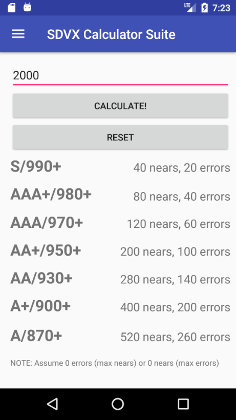
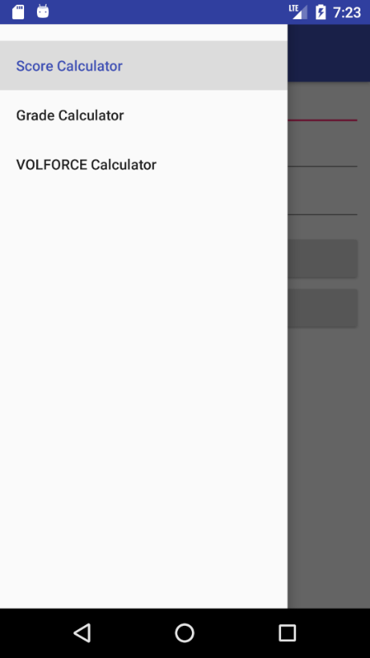
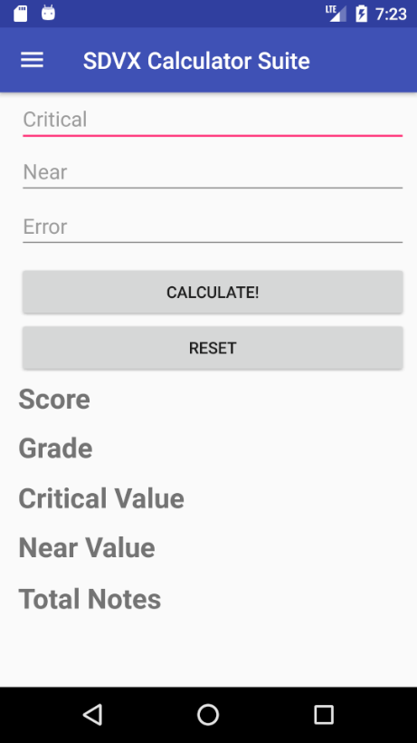

# SDVX_Calculator_Suite_Android
Android app that contains score, grade, and VOLFORCE calculators for Sound Voltex.  
**Currently a WIP**.  
	
Based on the web versions of the [Score](https://github.com/brenbread/SDVX-Score-Calculator), [Grade](https://github.com/brenbread/SDVX-Grade-Calculator),
and [VOLFORCE](https://github.com/brenbread/SDVX-VOLFORCE-Calculator) calculators.  

[v1 .apk download](https://github.com/brenbread/SDVX_Calculator_Suite_Android/raw/master/sdvx-calculator-suite-v1.apk)  
	

## TODO
- VOLFORCE calculator
- Better UI
- Landing page that links to the calculators

## Screenshots

